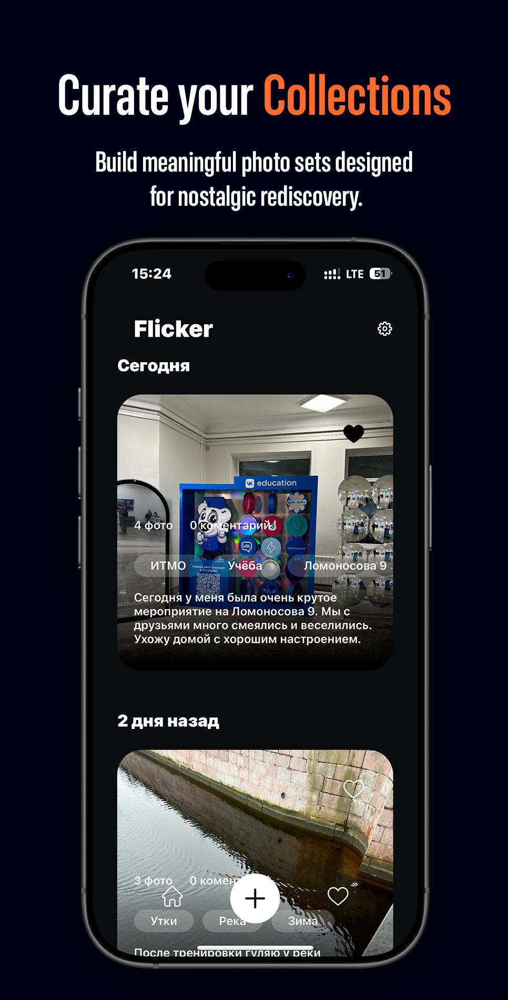
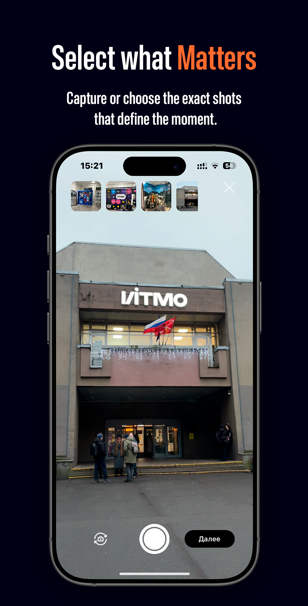
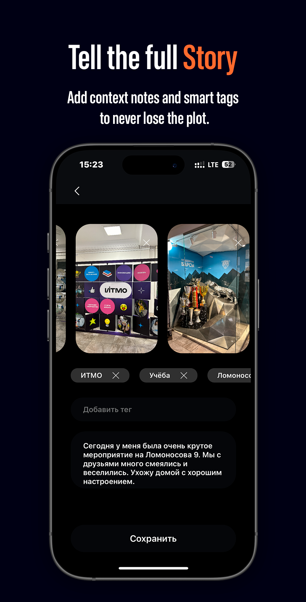

  
  
  

## Tech Stack

- **Language:** Swift 5
- **Interface:** UIKit
- **Architecture:** MVP
- **Storage:** Core Data & Keychain
- **Hardware:** AVFoundation (Camera)
- **Tools:** Xcode 16

## License
[Standart MIT license](LICENSE)